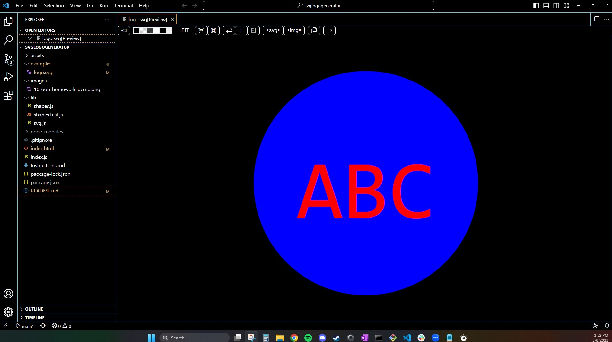

# SVG Logo Generator  

### <u> Description: </u>
This application prompts the user for 3 letters to use for an automatic SVG logo generator. User will choose a color for text, pick a shape, and shape color.

### <u> Notes: </u>
- 3 letters are chosen, shape is chosen, color of both text and shape are also chosen.
- Test have been run and are passing

### <u> Screenshot: </u>

  

    
### <u> Deployable Link to Website: </u>

https://drive.google.com/file/d/1xUWtt_BgxOVZmjmrivYhvyOfBmpolkwn/view
### <u> Support:  </u>

- [MDN](https://developer.mozilla.org/en-US/)  

- [Google](https://Google.com)

### <u> Contact: </u>

- [Contact - Future Coder - Joseph S. Ortega](mailto:MyAgentOrtega@gmail.com)

### <u> Acknowledgement </u>

Authors and acknowledgement: Thank you to all my peers, tutors and instructors that helped me along the way!

### <u> License </u>

